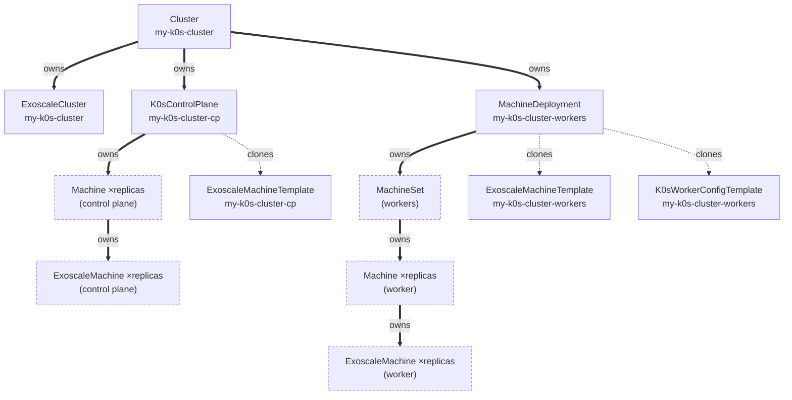

# Deploy a cluster with k0smotron

[k0smotron][k0smotron] can act as a Cluster API bootstrap/control-plane
provider in two ways:

- **Hosted control planes**: k0smotron runs the k0s control plane as pods
  *inside the management cluster* (`K0smotronControlPlane`). No control-plane
  `Machine`/`ExoscaleMachine` is created.
- **Machine-based control planes** (used here): k0smotron turns real Cluster
  API `Machine`s into k0s controllers (`K0sControlPlane`), so the control
  plane runs on Exoscale instances provisioned by this provider, exactly like
  the worker nodes. Nothing k0s-related runs in the management cluster itself.

This tutorial covers the machine-based setup, using the manifests in this
directory.

Prerequisites: Docker, `kind`, `kubectl` and Exoscale API credentials.

> **Run every command below from the root of the repository.**

## Resources

The manifests are split into three files:
* [cluster.yaml](cluster.yaml): the
cluster-wide `ExoscaleCluster`/`Cluster` objects
* [control-plane.yaml](control-plane.yaml)
the `K0sControlPlane` and its `ExoscaleMachineTemplate`
* [workers.yaml](workers.yaml): the `MachineDeployment` and its
`K0sWorkerConfigTemplate`/`ExoscaleMachineTemplate`



| Kind | Name | Role |
| --- | --- | --- |
| `ExoscaleCluster` | `my-k0s-cluster` | Provisions the cluster-wide Exoscale resources: the control-plane Elastic IP and the control-plane/node security groups. |
| `Cluster` | `my-k0s-cluster` | The CAPI object users and tools operate on (`kubectl wait cluster/...`, `clusterctl get kubeconfig ...`, `kubectl delete cluster/...`). |
| `ExoscaleMachineTemplate` | `my-k0s-cluster-cp` | Instance shape (image, type, disk) for control-plane nodes. |
| `K0sControlPlane` | `my-k0s-cluster-cp` | Creates and manages the control-plane `Machine`s (one per `spec.replicas`) and installs k0s as a controller on each. |
| `ExoscaleMachineTemplate` | `my-k0s-cluster-workers` | Instance shape for worker nodes. |
| `K0sWorkerConfigTemplate` | `my-k0s-cluster-workers` | Bootstrap data (installs k0s as a worker) for `MachineDeployment`-created `Machine`s. |
| `MachineDeployment` | `my-k0s-cluster-workers` | Creates and scales worker `Machine`s. |

## Install the k0smotron providers

k0smotron ships as a standard clusterctl provider (bootstrap + control-plane).
Skip the infrastructure provider as usual since the exoscale provider runs
locally via `make run`, not through clusterctl:
```bash
$> make clusterctl
$> kind create cluster --name capi-test
$> ./bin/clusterctl init --infrastructure - \
     --bootstrap k0sproject-k0smotron \
     --control-plane k0sproject-k0smotron
```

## Run CAPI
```bash
$> make generate manifests install
$> make run
```

Keep the manager running and use another terminal for the remaining commands.

## Deploy a k0s cluster

This starts with a minimal cluster: 1 control-plane node and 1 worker node.
Later sections scale each up independently.
```bash
$> export EXOSCALE_API_KEY=<api-key>
$> export EXOSCALE_API_SECRET=<api-secret>
$> kubectl create secret generic exoscale --from-literal=apikey=$EXOSCALE_API_KEY --from-literal=apisecret=$EXOSCALE_API_SECRET
$> kubectl apply -k config/samples/k0smotron/cluster
```

See the comments in [cluster.yaml](cluster.yaml) and
[control-plane.yaml](control-plane.yaml) for why each security group rule
and `k0sConfigSpec` setting is needed.

### Wait for the workload cluster
```bash
$> kubectl wait cluster/my-k0s-cluster --for=condition=RemoteConnectionProbe --timeout=10m
$> kubectl wait k0scontrolplane/my-k0s-cluster-cp --for=jsonpath='{.status.readyReplicas}'=1 --timeout=10m
$> kubectl wait machinedeployment/my-k0s-cluster-workers --for=jsonpath='{.status.readyReplicas}'=1 --timeout=10m
$> kubectl get secret my-k0s-cluster-kubeconfig -o jsonpath='{.data.value}' | base64 -d > /tmp/my-k0s-cluster.kubeconfig
$> kubectl --kubeconfig=/tmp/my-k0s-cluster.kubeconfig wait node --all --for=condition=Ready --timeout=10m

$> kubectl get cluster,exoscalecluster,machine,exoscalemachine,k0scontrolplane,machinedeployment
```

## Scale the worker nodes

Grow the worker pool from 1 to 3 nodes by patching `MachineDeployment.spec.replicas`:
```bash
$> kubectl patch machinedeployment my-k0s-cluster-workers --type=merge -p '{"spec":{"replicas":3}}'
$> kubectl wait machinedeployment/my-k0s-cluster-workers --for=jsonpath='{.status.readyReplicas}'=3 --timeout=10m
$> kubectl --kubeconfig=/tmp/my-k0s-cluster.kubeconfig wait node --all --for=condition=Ready --timeout=10m
```

The equivalent declarative change, if you'd rather edit
[workers.yaml](workers.yaml) and re-`apply` instead of patching:
```diff
 apiVersion: cluster.x-k8s.io/v1beta2
 kind: MachineDeployment
 metadata:
   name: my-k0s-cluster-workers
   namespace: default
 spec:
   clusterName: my-k0s-cluster
-  replicas: 1
+  replicas: 3
   selector:
     matchLabels:
       cluster.x-k8s.io/cluster-name: my-k0s-cluster
       pool: worker-pool-1
   [...]
```

## Scale the control plane

Grow the control plane from 1 to 3 nodes for high availability by patching
`K0sControlPlane.spec.replicas`. `ExoscaleCluster` already provisions a
managed Exoscale Elastic IP as the control-plane endpoint, fronting all
control-plane instances behind one address with health-checked failover, so
nothing else needs to change for clients of the cluster:
```bash
$> kubectl patch k0scontrolplane my-k0s-cluster-cp --type=merge -p '{"spec":{"replicas":3}}'
$> kubectl wait k0scontrolplane/my-k0s-cluster-cp --for=jsonpath='{.status.readyReplicas}'=3 --timeout=10m
$> kubectl --kubeconfig=/tmp/my-k0s-cluster.kubeconfig wait node --all --for=condition=Ready --timeout=10m
```

The equivalent declarative change, if you'd rather edit
[control-plane.yaml](control-plane.yaml) and re-`apply` instead of patching:
```diff
 apiVersion: controlplane.cluster.x-k8s.io/v1beta2
 kind: K0sControlPlane
 metadata:
   name: my-k0s-cluster-cp
   namespace: default
 spec:
-  replicas: 1
+  replicas: 3
   version: v1.36.3+k0s.0
   [...]
```

The 2nd and 3rd control-plane nodes join the 1st one's etcd via the k0s
controller join API, see the `securityGroupControlPlane` comment in
[cluster.yaml](cluster.yaml), which opens that port from the start for
exactly this step.


## Try it: a smoke-test workload

`node --for=condition=Ready` above only proves kubelet is checking in. It
says nothing about pod scheduling, Service routing, DNS, ... . A `DaemonSet`
schedules one pod per eligible node without having to track the worker
count — and since the control-plane node carries the `control-plane:NoSchedule`
taint (see [control-plane.yaml](control-plane.yaml)), it naturally lands only
on workers, one nginx per worker. Deploy it and reach it through a Service to
confirm those work end to end:
```bash
$> kubectl --kubeconfig=/tmp/my-k0s-cluster.kubeconfig apply -f - <<EOF
apiVersion: apps/v1
kind: DaemonSet
metadata:
  name: smoke-test
spec:
  selector:
    matchLabels:
      app: smoke-test
  template:
    metadata:
      labels:
        app: smoke-test
    spec:
      containers:
        - name: nginx
          image: nginx
---
apiVersion: v1
kind: Service
metadata:
  name: smoke-test
spec:
  selector:
    app: smoke-test
  ports:
    - port: 80
EOF
$> kubectl --kubeconfig=/tmp/my-k0s-cluster.kubeconfig rollout status daemonset/smoke-test --timeout=5m
$> kubectl --kubeconfig=/tmp/my-k0s-cluster.kubeconfig get pods -l app=smoke-test -o wide
$> kubectl --kubeconfig=/tmp/my-k0s-cluster.kubeconfig run curl --rm -it --restart=Never --image=curlimages/curl -- curl -s smoke-test
<!DOCTYPE html>
<html>
<head>
<title>Welcome to nginx!</title>
...
```

A 200 response there means the pods came up, `kube-proxy`/`kube-router`
routed the request through the `smoke-test` Service to one of them, and
CoreDNS resolved the Service name. Since a pod is running on every worker,
this also exercises cross-node routing whenever the Service picks a backend
on a different node than the `curl` pod landed on.

Clean up once you're done:
```bash
$> kubectl --kubeconfig=/tmp/my-k0s-cluster.kubeconfig delete daemonset,service smoke-test
```

## Delete the k0s cluster
```bash
$> kubectl delete cluster/my-k0s-cluster # also deletes its Machines and Exoscale resources
```

The shared `exoscale` credential Secret is not owned by the Cluster and
remains after Cluster deletion.

[k0smotron]: https://docs.k0smotron.io
[k0s-releases]: https://github.com/k0sproject/k0s/releases
